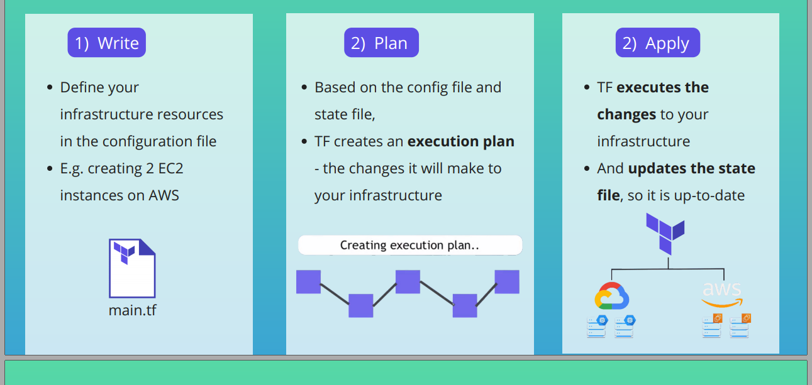

# TERRAFORM  

## 1. What is Terraform?  
* An open-source infrastructure as code (IaC) tool.
* "Terraform is a tool for building, changing, and versioning infrastructure safely and efficiently" - Hashicorp.
* Infrastructure provisioning-focused tool.  
* Let's you **automate and manage**: infrastructure, platform and services running on that platform.  

## 2. Why to use  
* Allows us to apply software development best practices to infrastructure development. E.g. Version control, code reviews, etc.
* Compatible with many clouds and services, almost any services that provides APIs.
* Allow us to **Automate** continuous changes to our infra.
* Allow us to easy **replicate** infra **on different environments**, like Dev, Staging, Prod.

## 3. How it works  
* Terraform + Ansible (config mgmt)  
  
  TF provisions VMs > Ansible installs all necessary dependencies.
* Terraform + Templating Tools  
   
  TF provisions servers and Server templating, e.g. Packer from Hashicorp, is used to build the image from which those VMs are created. All dependences are pre-packaged into the machine image.
* Terraform + Kubernetes 
    
  TF defines cloud resources and K8s to define how our application is deployed and managed on those cloud resources.

### Terraform Architecture
  

### Configuration file
* Define the resources in human-readable **configuratin file** that you can *version*, *re-use*, and *share.*
* Definition configuration file is **declarative**.  
  - Declarative: defines **WHAT** the end result or desired state is.  
  - Imperative: defines the exact steps to follow - **HOW**.
 * IT / Cloud providers allow creating/managing their resources through GUI console and CLI or API, the last one being faster. 
 
  
### Providers  
In terraform we connect to a technology (AWS, Jenkins, Databases, etc) and use their API to create resources and configure them.
 * Plugins Terraform uses to manage the resources.
* Providers expose resources for specific infrastructure platform (e.g. AWS).
* Responsible for understanding API of that platform.
* Just code that knows how to talk to specific technology or platform.  

[Browse Terraform Providers](https://registry.terraform.io/browse/providers)

### Resources
* To create a new resource.  
  


### Data Sources
* To query an existing resource  

  
Note: As in resources you preoviously need to specify the provider. Eg. provider "aws"

### Tags
* Basically are labels for human consumption to have more information about the resources.
*  Also for referencing components from other components (programatically). E.g. Cloud Controller Managers.  
      

### Variables
* Let us **customize** behaviour without editing the configuration file.  
2 Step to use variables:  
    1. **Define** variables (inside config file main.tf or variables specific file, e.g variables.tf), and use it in your TF script.
    2. **Set** variables **values** when applying the script. 

    

    3 Steps to set variable values
    
    Note: Every environment could have its own var file. E.g. terraform-dev.tfvars, terraform-staging.tfvars, terraform-prod.tfvars. 

### Environmental Variables
* TF-Env Var: TF has env vars, you can use them to change TF's default hehaviour, e.g. TF Logs:
  ```Bash
    export TF_LOG=off
  ```
* AWS Env Vars: Set AWS credentials for AWS provider as environment variable.
  
### 3. Removing / Destroying Resources
Option 1: Just remove the resource code from within config file, and apply again.  
Note: This is **recommended** because your config file will correspond  your current state.
OPtion 2:  Destroy command:  
terraform destroy -target [resource type.resource name]  
E.g.
```bash
    terraform destroy -target aws_subnet.dev-subnet-2
```
### Output
- Prints resource values after applying config file, it's another option to 'show state' command to find that info.  
Add this portion to the config file.
```json
    output "dev-vpc-id" {
        value = aws_vpc.development-vpc.id
    }
```

## 8. TF Core cmds  
- `terraform init` = get your project folder ready with providers
- `terraform plan` = show what is going to be created, and changed during the next command based on our code.
Also shows provider's list of **available resources names**.  
- `terraform apply` = will go and deploy the resources defined in our code.
- `terraform apply -auto-approve` = apply configuration without confirming.
- `terraform destroy` = will destroy the resources we have created in our project  
- `terraform destroy` = will destroy the resources we have created in our project.
Note: Good thing, you don't have to know in which **order** you need **to delete the resources**.
- `terraform destroy` = will destroy the resources we have created in our project  
Note: Good thing, you don't have to know in which **order** you need **to delete the resources**.

## 9. TShoot Terraform  
#### Queryng/Check detailed resources state easely  
- Check **terrafrom.tfstate**, stores the current state inside this JSON file, it has the current list of resources and their current state.  
- State cmd
    ```bash
        terraform state
    ```
    Show all resources attributes
    ```bash    
        terraform state show <resource_type.resource_name>
        terraform state show aws_subnet.dev-subnet-1
    ```

#### Backup file 
**terrafrom.tfstate.backup**: Previous state applying/destroying.

## 10. Automating AWS Infrastructure  
* ### Provisioning EC2 Instane on AWS  
    1. Create custom **VPC**
    2. Create custom **Subnet**
    3. Create **Route Table** & **Internet Gateway**  
         - Associate it to subnet
    4. Provision **EC2 Instance**
    5. Deploy nginx Docker container
    6. Create Security Group (Firewall)

    Tip:
    * It is recommened NOT to use the default resources AWS gives you, e.g. defaulta vpc, default subnet, etc. Instead create new ones, in case we need to destroy everything.  
* ### Run Nginx Docker container on EC2 instance


Creating a structured terraform project with standard modules.
Structuring terraform project with standarized modules. (group of similar resources)
Using modules, how to reference resources inside.


