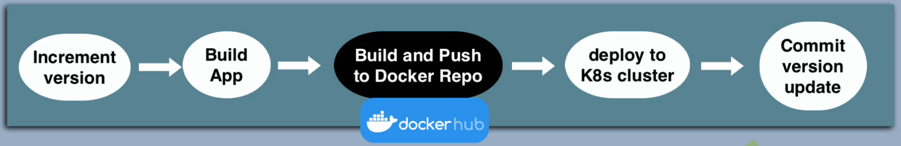
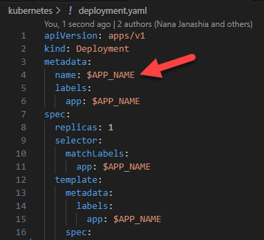
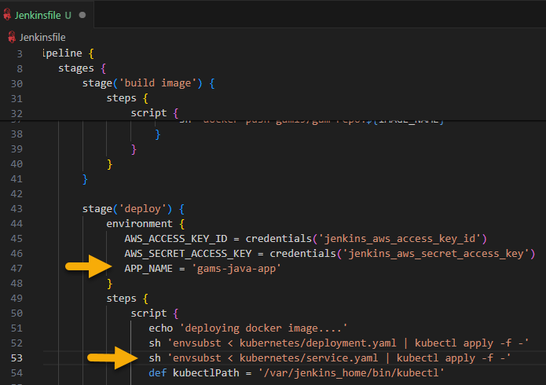
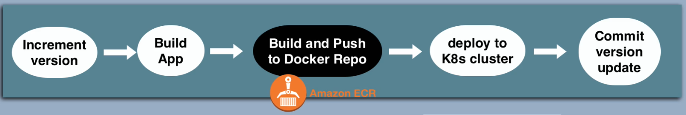

Pipeline jenkins-jobs

Jenkins > Gitlab > Docker Hub | Jenkins > EKS



* Use a new or existing Jenkins Pipeline.  
* Create K8s Deployment and Service yaml files  
    Note: In our Pipeline everytime we want to deploy a new version of our app we will have to create K8s Deployment and Service.  
* In Gitlab Update jenkins file in corresponding branch.  
    Tip: Use environmental variables to pass app name and image name.  
    Ej 1:  
      

    Ej 2:
    

* Install 'gettext-base'  in Jenkins container/server.
It contains the 'envisubst' tool.
  ```bash
    apt-get update
    apt-get install gettext-base
  ```
* Create K8s secret to auth with Docker Registry  
 To access docker image  in Docker Registry privage repo we need to authenticate from K8s cluster. Hence we need to create a secret.  
 Tip: 
    * Don't create in Pipeline otherwise secret will be recreate everytime the pipeline runs. 
    We only need the secret be created once.
    * Secret usually will be hosted in projects repo.
    * One secret per K8s Namespace.
    * You could also [create the secret](Containerization/Creating%20K8s%20secret.md) it directly in the K8s cluster from kubectl.


Jenkins > ECS > EKS

